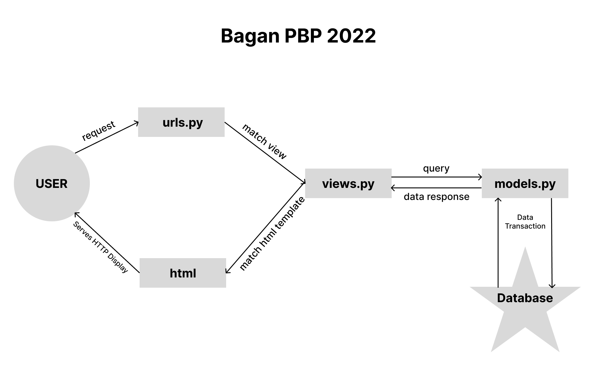

# Tugas 3 PBP 19 September 2022

## Perbedaan JSON, XML, dan HTML

### JSON

JSON atau Javascript Object Notion adalah sebuah format untuk menstrukturkan data.

Beberapa keuntungan dari JSON adalah:

- _Human-readable_ dan bisa ditulis sendiri.
- Karena bentuk data yang simpel, membuat transfer data JSON ringan dan mudah dibaca dan ditulis dibandingkan XML.

- Banyak digunakan sebagai penyimpanan data dan cara berkomunikasi antar web.

- Walaupun diturunkan dari bahasa Javascript, JSON tidak bergantung pada bahasa. Maka, kode untuk membuat atau memakai JSON bisa ditulis dalam bahasa apapun.

### XML

- Extensible Markup Language (XML) adalah bahasa komputer yang dibuat oleh World Wide Web Consortium (W3C) untuk menyederhanakan proses pertukaran dan penyimpanan data.

- JSON lebih sederhana daripada XML, tetapi XML lebih kuat. Untuk aplikasi umum, semantik singkat JSON menghasilkan kode yang lebih mudah diikut i. Untuk aplikasi dengan persyaratan kompleks seputar pertukaran data, seperti di perusahaan, fitur kuat XML dapat mengurangi risiko perangkat lunak secara signifikan.

### HTML

- Hypertext Markup Language atau HTML adalah bahasa markup standar yang digunakan untuk membuat halaman website dan aplikasi web.

## Alasan _data delivery_ dibutuhkan dalam sebuah web platform.

### Penyampaian data yang disimpan di database ke frontend

- Tentunya data yang disimpan dalam database akan digunakan pada suatu saat, karena itu, _data delivery_ dibutuhkan dalam pembuatan sebuah aplikasi.

- Penyampaian data bisa dalam JSON, XML, atau format penyampaian data lainnya.

### Karena dalam sebuah tim, developer frontend dan backend adalah 2 tim yang berbeda

- Tim Frontend hanya perlu memanggil suatu url yang dikerjakan oleh tim backend dan membuat frontend yang menggunakan data yang diberikan backend

- Tim backend hanya perlu menyediakan url dan menangani request dari frontend

## Cara implementasi aplikasi mywishlist

### Pembuatan fixtures yang berisi `initial_watchlist_data.json`

- Pembuatan _constants_ film-film yang sudah/belum pernah saya tonton, diisi dengan data-data yang sesuai model `MyWatchList`.

### Pembuatan `models.py`

- Buat sebuah Model `MyWatchList` dengan fields:
  - watched: Boolean Field (default = $False$)
  - title: Character Field (max_length = $100$)
  - rating: Decimal Field ($1 \leq rating \leq $)
  - release_date: Date Field (menyimpan tanggal/bulan/tahun)
  - review: Text Field

### Pembuatan `views.py` dan `urls.py`

- Pembuatan `show_xml`, `show_json`, dan `show_html`

  - `show_xml` dan `show_json` hanya mengembalikan data pada model `MyWatchList` dalam bentuk **JSON** dan **XML**

  - `show_html` menerima context yang berupa data watchlist di database, dan mengembalikan `watchlist.html`

- Pembuatan `urls.py`

  - `urls.py` memiliki 3 routes, `show_html`, `show_json`, `show_xml`, dan `index` yang mengembalikan HttpResponse kosong.

### Pembuatan `watchlist.html`

- `watchlist.html` berisi frontend yang akan mengembalikan html yang menyediakan data-data `watchlist` dalam bentuk tabel.

- `` dan import `style.css` yang dibuat membantu agar styling css yang dibuat diterapkan ke `watchlist.html`

# Tugas 2 PBP 12 September 2022

## 1. Bagan Request User dan korelasi `urls.py`, `models.py`, `views.py`, dan `html`



## 2. Virtual Environtment

Virtual Environment digunakan untuk menjaga lingkungan development tetap konsisten dan terpisah dari lingkungan pribadi Anda, bisa saja anda mengerjakan projek yang menggunakan versi python berbeda dengan python yang ada di komputer pribadi Anda. Virtual environment membantu agar versioning yang instalasi yang Anda lakukan tetap terjaga didalam environment tersebut.

## 3. Penjelasan Implementasi

### 1. Implementasi `views.py`

Saya membuat 3 fungsi, yang pertama fungsi index, fungsi index bisa dilihat sebagai berikut:

```py
def index(request):
  cart = Cart.objects.first()
  cart = [{"item": cart_item.item, "count": cart_item.count} for cart_item in cart.items.all()]

  return render(request, "shop.html", {
    "cart_size": len(cart),
    "cart": cart,
    "items": Item.objects.all()
  })
```

Fungsi index mengembalikan render dari sebuah file yang bernama `shop.html` (disimpan di template/shop.html), dan diberikan context yang berisi cart_size, cart, dan items, cart, masing-masing data yang disediakan ke front-end (HTML) melalui context diambil dari database yang tabelnya dispecify di `models.py`

### 2. Implementasi `urls.py`

`urls.py` adalah file yang mengatur routing aplikasi django kita

```py
urlpatterns = [
  path('', index, name='index'),
  path('add_to_cart/<str:item_uuid>/', add_to_cart, name="add_to_cart"),
  path('reduce_from_cart/<str:item_uuid>/', reduce_from_cart, name="reduce_from_cart"),
]
```

Seperti yang bisa dilihat di kode di atas, masing-masing path yang dinyatakan masing-masing menyatakan sebuah route. Sebagai contoh:

```py
path('', index, name='index')
```

Path tersebut menyatakan `url: {domain}/shop/, function: index, nama: 'index'` . Fungsi index akan dipanggil saat route yang dipanggil sesuai dengan path yang dinyatakan.

### 3. Implementasi `shop.html`

Dari data yang kita berikan dalam bentuk context ke template (HTML), kita bisa tampilkan data yang diberikan tersebut

```html
<div class="item-card-container">
	<div class="button-container">
		
		<div class="item-card-button">
			<a href="" class="item-card-cover">
				<div
					style="
              font-weight: 700;
              font-size: large;
              font-family: 'Lucida Sans', 'Lucida Sans Regular', 'Lucida Grande',
                'Lucida Sans Unicode', Geneva, Verdana, sans-serif;
            "
				>
					{{ item.name }}
				</div>
				<div
					style="
              font-weight: 500;
              font-size: medium;
              font-family: 'Lucida Sans', 'Lucida Sans Regular', 'Lucida Grande',
                'Lucida Sans Unicode', Geneva, Verdana, sans-serif;
            "
				>
					Rp{{ item.get_price_in_rupiah }}
				</div>
				<div class="item-card-cta" style="border: none">Add to cart</div>
			</a>
			
		</div>
		
	</div>
</div>
```

Seperti contoh HTML di atas, kita bisa lihat bahwa data-data yang diberikan oleh backend diterima oleh frontend kita, contoh penggunaan data `{{ item.name }}` artinya cek attribut `name` dari variabel `name` yang di-_passing_ oleh backend.

## 4. Deployment

Deployment Heroku untuk app ini bisa dilihat melalui: [Heroku App](https://andrew-pbp-tugas2.herokuapp.com/shop/).

Deployment heroku berjalan secara otomatis melalui `deploy.yml` yang dijalankan oleh Github Actions, setelah menyesuaikan settings.py untuk deployment, push repository github dan masukkan `HEROKU_API_KEY` dan `HEROKU_APP_NAME` kepada secrets variabel di github dan heroku.
